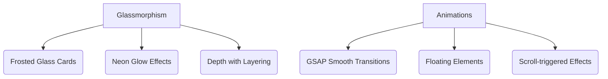

# <div align="center">✨ Divyajeet's Portfolio ✨</div>

<div align="center">
  
  
  
</div>

<br>

<div align="center">
[](https://app.netlify.com/sites/divyajeet/deploys)
</div>

## 🌟 Features

- 🎨 **Modern Glassmorphism UI** with smooth animations
- 🌓 **Theme Switcher** (Light/Dark/High Contrast)
- 🚀 **Interactive 3D Particle Background**
- 📱 **Fully Responsive** across all devices
- ✉️ **Functional Contact Form** with validation
- 🛠 **Project Showcase** with filtering capabilities


+ Built with cutting-edge web technologies for optimal performance


## 🛠 Technologies Used

| Category        | Technologies                                                                 |
|-----------------|------------------------------------------------------------------------------|
| **Frontend**    |     |
| **Libraries**   |   |
| **Tools**       |   |

## 🎨 Design Highlights



## 🚀 Getting Started

### Prerequisites
- Modern web browser (Chrome, Firefox, Edge)
- Node.js (for local development)

### Installation
```bash
# Clone the repository
git clone https://github.com/Divyajeet7978/portfolio.git

# Navigate to project directory
cd portfolio

# Open in browser (no build required)
open index.html
```

## 📂 Project Structure
```
portfolio/
├── index.html          # Main HTML file
├── css/                # CSS styles
├── img/                # All project images
├── js/                 # JavaScript files
└── README.md           # This documentation
```

## 🌈 Color Palette
| Color          | Hex                                                                |
|----------------|--------------------------------------------------------------------|
| Primary        | `#6366f1` |
| Secondary      | `#a855f7` |
| Accent         | `#ec4899` |
| Dark Background| `#111827` |
| Light Text     | `#f9fafb` |

## 📸 Screenshots

<div align="center">
  
    
</div>

## 📬 Contact

Divyajeet Panda - divyajeetpanda@outlook.com

Project Link: [https://github.com/Divyajeet7978/portfolio](https://github.com/Divyajeet7978/portfolio)

<div align="center">
   
</div>
